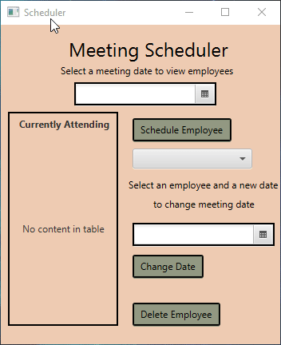

# EmployeeJavaFX_DB
* Nicolo Martina
* COP 3003 - Intro to Object Oriented Programming
* Java GUI Database Program

# Meeting Scheduler

This software is a basic implementation of a database that features employee information. Contains a table with an automatically generated ID number, first name, last name, and meet date. Features an easy-to-use GUI interface that allows the user to select a date and view which employees have a meeting. Connects and interacts with the database using DBUtil.java class and methods. Utilizes Queries, ResultSets, and CachedRowSets to read and store information to and from the database. Database values are stored in Employee.java Object fields, which are then stored in an ObservableList for viewing. The Employee class utilizes SimpleStringProperty to display in the TableView JavaFX element.

# User Guide
* Select a date from the first date picker box to see which employees are scheduled for a meeting on that particular day.
* If no employees have a meeting, then the table remains empty. If there are employees scheduled for that day, they are listed in the table.
* To schedule an employee, first select a date. Then from the drop down box, select an employee. Hit the 'Schedule Employee' button to add the meeting date to the employee's record.
* There's also the option to delete the employee from the database completely. Select an employee from the table and hit 'Delete Employee'.

# GUI Design Principles
From: http://bokardo.com/principles-of-user-interface-design/
This software shows clarity in design, allowing for quick recognizition of functionality and ease of use. Only contains the basic elements needed as to not clutter the screen. Only one screen is used to provide quick actions with no need for transitions. Buttons and boxes are highlighted in black for a clear view on what the user can interact with. 

# Demo

